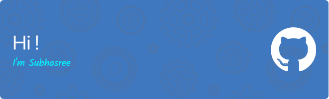

<link rel="stylesheet" href="https://cdn.jsdelivr.net/gh/devicons/devicon@v2.15.1/devicon.min.css">

   

 

- I’m currently exploring Web Development and Competitive Programming
- Pursuing III year in Computer Science and Engineering :computer:
- I’m looking forward to learn new technologies and doing good projects </>
- Reach me thru :
   - [LinkedIn](https://www.linkedin.com/in/subhasree-m/)
   - [Email](mailto:subhasreemurugan6@gmail.com)

 
   

<h3 align="center" font-weight="bold">Languages and Tools</h3>
 

 &nbsp;
  &nbsp;
  &nbsp;
 &nbsp;
 &nbsp;
 &nbsp;
 
   
 &nbsp;
 &nbsp;
 &nbsp;
 &nbsp;
 
   
 &nbsp;
 &nbsp;
 &nbsp;
 &nbsp;
 &nbsp;

 

 

<!--

 
-->

                                                                                                                                                    

 
 

  

  
 
                   
 

 
   

 
 
And these are my Repos :point_down::point_down:
